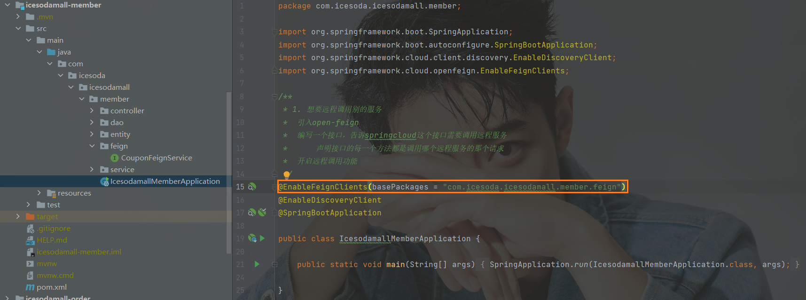

## OpenFeign

> ​	Feign是一个声明式的HTTP客户端，它的目的就是让远程调用更加简单。Feign提供了HTTP请求的模板，**通过编写简单的接口和插入注解**，就可以定义好HTTP请求的参数、格式、地址等信息。
>
> ​	Feign整合了**Ribbon(负载均衡)**和**Hystrix(服务熔断)**可以让我们不再需要显式地使用这两个组件。
>
> ​	SpringCloudFeign在NetflixFeign的基础上扩展了对SpringMVC注解的支持，在其实现下，只需创建一个接口并用注解的方式来配置它，即可完成对服务提供方的接口绑定。简化了SpringCloudRibbon自行封装服务调用客户端的开发量。

- 引入依赖

  

- eg：member调用coupon服务

  

  ps：R代表 **ResultEntity**

### 想要远程调用别的服务

- 引入open-feign

- 编写一个接口，告诉SpringCloud这个接口需要调用远程服务

  1. 声明接口的每一个方法都是调用哪个远程服务的哪个请求

	
	
- 开启远程调用功能 

  **@EnableFeignClients**

  

- 测试（会员服务中远程调用优惠券）

  在会员服务的controller中调入优惠券远程接口

  

  远程获取结果：（被调用服务必须上线）

  

